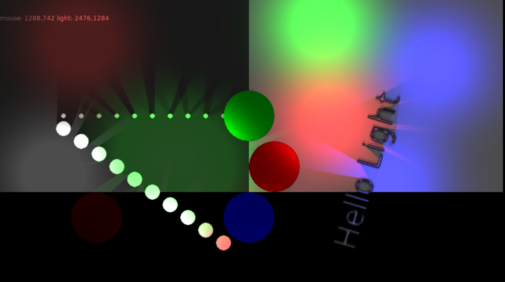

Light & Shadow
==============

A simple dynamic light shadow library for LOVE2D 11.2


## Example

!


##Usage

```
local Lib = require 'light'
local light_world = Lib.World.new()
local light

local lg = love.grpahics

function love.load()
  light = light_world:add(200, 200, 200, 1, 0, 0)
end

function love.update(dt)
  light.x, light.y = love.mouse.getPosition()
end

function love.draw()
  -- reset light world
  light_world:begin()

  for i = 1, 10 do
    lg.circle('fill', 100 + i * 70, 300, 10)
  end

  -- draw shadow for those objects
  light_world:track()
  for i = 1, 10 do
    lg.circle('fill', 100 + i * 70, 300 + i * 50, 30)
  end
  -- stop track, new object is background
  light_world:stop()

  for i = 1, 10 do
    lg.circle('fill', 100 + i * 70, 500 + i * 50, 30)
  end

  -- draw scene, light and shadow
  light_world:finish()

  lg.print('mouse: '..mx..','..my..' light: '..light.x..','..light.y, 50, 50)
end
```


## Functions

### World

* `World.new({ env_light = { 0.5, 0.4, 0.5, 0.5 }, alpha_through = 0.3 })` if a object alpha less than `alpha_through`, we will not generate shadow for it
* `World:begin()` reset light world and start track bg pixels.
* `World:track()` start trace object pixels to generate shadow
* `World:track_light_objs()` switch to draw object that always is light and it has shadow
* `World:stop()` stop trace object pixels, back to track bg  pixels
* `World:finish()` draw bg, objects, light and shadow
* `World:add(x, y, radius, r, g, b, a)` add a light to world, return `light`
* `World:remove(light)` remove the light from world
* `World:clear()` remove all lights
* `World:setEnvLight(r, g, b, a)`
* `World:resize(w, h)` you must call it after change window size
* `World:setTranslate(x, y, scale)` you must call it if your applied `love.graphics.translate` or `love.graphics.scale`


### Light

* `Light:setSize(radius)` resize the light


## Tips

* If the `env_light` is `1, 1, 1, 1`, no light and shadow can be draw. In an overly bright environment you will not see light and shadow
* If the background alpha is too little, we will not see the light because no object can reflect this light into your eyes
* When you have a lot of light, it will very slow. the light size and quantity will affect performance. (I will try to make it faster)
